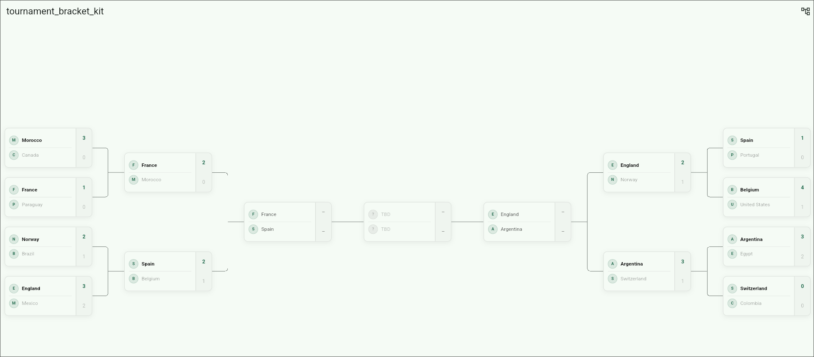

# Tournament Bracket Kit


A customizable Flutter widget for **single-elimination tournament brackets** with pan/zoom, round tabs, and fully customizable match cards.

## Demo




## Features

- **Single-elimination layout:** Renders bracket columns with elbow connectors automatically
- **Two layout variants:** Classic left-to-right, or a mirrored bracket with the final in the center
- **Pan & zoom:** Smooth navigation via `InteractiveViewer` with optional pinch-to-zoom
- **Round tabs:** Tap a round to instantly pan the viewport to that column
- **Custom match card builder:** Provide your own widget for full control over match card UI
- **Default Material match card:** Works out of the box with no extra setup
- **Flexible sizing:** Control card dimensions, connector width, line color, and spacing
- **Dummy data helpers:** Built-in helpers to get up and running quickly for demos and tests
- **Zero third-party dependencies:** Pure Flutter, nothing extra to install


## Getting started

Install it using pub:

```yaml
flutter pub add tournament_bracket_kit
```

And import the package:

```dart
import 'package:tournament_bracket_kit/tournament_bracket_kit.dart';
```


## Usage

### Basic example

Render a bracket with the default card and a tap callback:

```dart
TournamentBracket(
  rounds: dummyBracketRounds(),
  onMatchTap: (match) => debugPrint(match.id),
)
```

### Mirrored bracket

Set `variant: BracketVariant.mirrored` to render a two-sided bracket - the
first half of each round progresses left-to-right, the second half
right-to-left, and the final sits in the center:

```text
Player A --------,                          ,-------- Player H
                 +-------,          ,-------+
Player B --------'       |          |       '-------- Player G
                         +---Final--+
Player C --------,       |          |       ,-------- Player F
                 +-------'          '-------+
Player D --------'                          '-------- Player E
```

```dart
TournamentBracket(
  rounds: dummyBracketRounds(),
  variant: BracketVariant.mirrored,
  onMatchTap: (match) => debugPrint(match.id),
)
```

Your data does not change - the same `List<BracketRound>` drives both variants.
The first `ceil(n / 2)` matches of each round go to the left half and the rest
go to the right, each half keeping its original top-to-bottom order, and the
last round becomes the center column.

Because the point of this layout is seeing the whole bracket at once, it is
scaled down to fit the viewport instead of scrolling round by round. That means:

- `showRoundTabs` does not apply (a round spans two columns), so no tab bar is shown
- `enableScale` defaults to `true` here, so users can pinch to read small cards
- `enablePan` lets users drag the bracket around once zoomed in

It works best with a bounded height (inside a `Scaffold` body, `Expanded`, or a
`SizedBox`) and on wider screens - a 16-team bracket on a phone will need
zooming.

### Advanced example

Custom sizing, zoom enabled, and a snack bar on tap:

```dart
TournamentBracket(
  rounds: rounds,
  cardHeight: 110,
  cardWidth: 240,
  itemsMarginVertical: 28,
  enableScale: true,
  onMatchTap: (match) {
    ScaffoldMessenger.of(context).showSnackBar(
      SnackBar(
        content: Text('${match.home?.name ?? 'TBD'} vs ${match.away?.name ?? 'TBD'}'),
      ),
    );
  },
)
```

### Custom match card

Replace the default card with your own widget:

```dart
TournamentBracket(
  rounds: myRounds,
  matchBuilder: (context, match) {
    return MyFancyCard(match: match);
  },
)
```


## Data model

Build your rounds from `BracketRound`, `BracketMatch`, `BracketTeam`, and `BracketScore`:

```dart
final rounds = [
  BracketRound(
    title: 'Semi Finals',
    matches: [
      BracketMatch(
        id: 'sf1',
        home: BracketTeam(id: '1', name: 'Team A'),
        away: BracketTeam(id: '2', name: 'Team B'),
        isCompleted: true,
        score: BracketScore(homeScore: 2, awayScore: 1, winnerId: '1'),
      ),
      BracketMatch(
        id: 'sf2',
        home: BracketTeam(id: '3', name: 'Team C'),
        away: BracketTeam(id: '4', name: 'Team D'),
      ),
    ],
  ),
  BracketRound(
    title: 'Final',
    matches: [
      BracketMatch(
        id: 'f1',
        home: BracketTeam(id: '1', name: 'Team A'),
      ),
    ],
  ),
];
```

Map your API models into these types - the package stays UI-only.


## TournamentBracket constructor

| Parameter | Type | Default | Description |
|---|---|---|---|
| **rounds** | `List<BracketRound>` | required | Bracket rounds from earliest round to final |
| **variant** *(optional)* | `BracketVariant` | `BracketVariant.linear` | `linear` for the classic left-to-right bracket, `mirrored` for a two-sided bracket with the final in the center |
| **matchBuilder** *(optional)* | `Widget Function(BuildContext, BracketMatch)?` | `null` | Custom match card builder. Defaults to `DefaultBracketMatchCard` |
| **onMatchTap** *(optional)* | `void Function(BracketMatch)?` | `null` | Fired when the default card is tapped. Ignored if `matchBuilder` is set |
| **cardHeight** *(optional)* | `double` | `100` | Height of each match card slot |
| **cardWidth** *(optional)* | `double` | `220` | Width of each match card / round column |
| **itemsMarginVertical** *(optional)* | `double` | `24` | Base vertical margin between first-round cards |
| **connectorWidth** *(optional)* | `double` | `80` | Width of the elbow connector between rounds |
| **lineColor** *(optional)* | `Color?` | `ThemeData.dividerColor` | Bracket connector line color |
| **lineWidth** *(optional)* | `double` | `1` | Bracket connector line stroke width |
| **showRoundTabs** *(optional)* | `bool` | `true` | Whether to show the round tab bar above the bracket. Ignored when `variant` is `mirrored` |
| **enablePan** *(optional)* | `bool` | `true` | Whether the bracket can be panned |
| **enableScale** *(optional)* | `bool?` | `false` linear / `true` mirrored | Whether pinch-to-zoom is enabled |
| **minScale** *(optional)* | `double` | `0.4` | Minimum zoom level when `enableScale` is true |
| **maxScale** *(optional)* | `double` | `2.5` | Maximum zoom level when `enableScale` is true |
| **transformationController** *(optional)* | `TransformationController?` | `null` | Unused, kept for API compatibility. Use `enablePan` to control scrolling |


## BracketMatch model

| Field | Type | Description |
|---|---|---|
| **id** | `String` | Unique identifier for the match |
| **home** *(optional)* | `BracketTeam?` | Home / team A. `null` when the slot is TBD or a bye |
| **away** *(optional)* | `BracketTeam?` | Away / team B. `null` when the slot is TBD or a bye |
| **score** *(optional)* | `BracketScore?` | Score and winner info |
| **isCompleted** *(optional)* | `bool` | Whether the match has finished. Defaults to `false` |
| **metadata** *(optional)* | `Map<String, Object?>?` | Free-form bag for host-app data (e.g. match date, venue) |


## BracketTeam model

| Field | Type | Description |
|---|---|---|
| **id** | `String` | Unique identifier for the team |
| **name** | `String` | Display name of the team |
| **logoUrl** *(optional)* | `String?` | Optional logo URL (network or asset path) |


## BracketScore model

| Field | Type | Description |
|---|---|---|
| **homeScore** *(optional)* | `int?` | Score for the home / team A side |
| **awayScore** *(optional)* | `int?` | Score for the away / team B side |
| **winnerId** *(optional)* | `String?` | Id of the winning `BracketTeam`, if decided |


## Author

This package was developed by [sawongam](https://github.com/sawongam)
